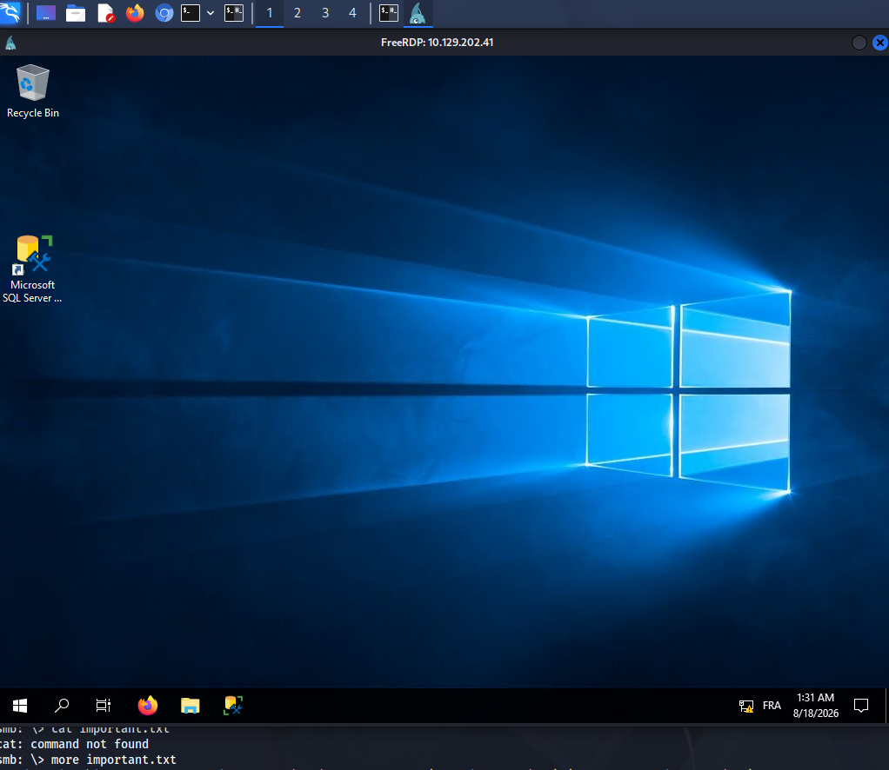
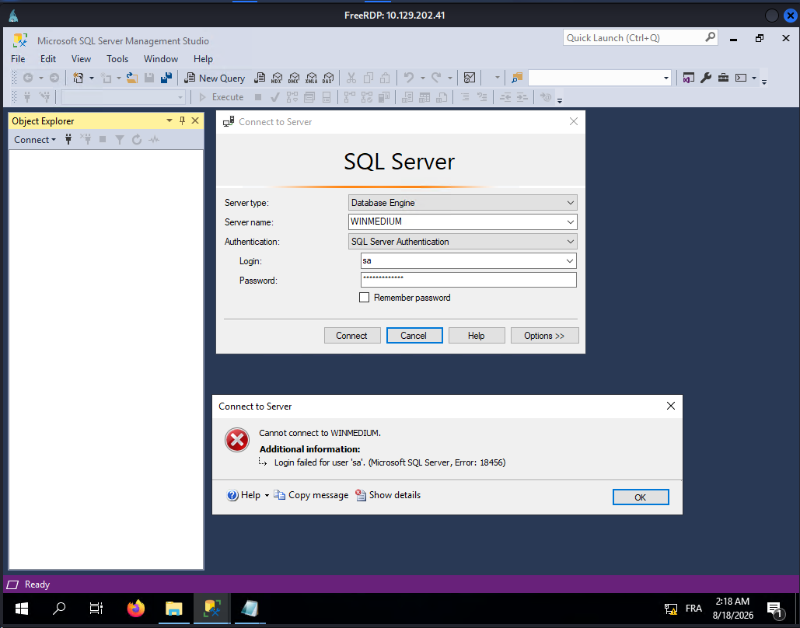
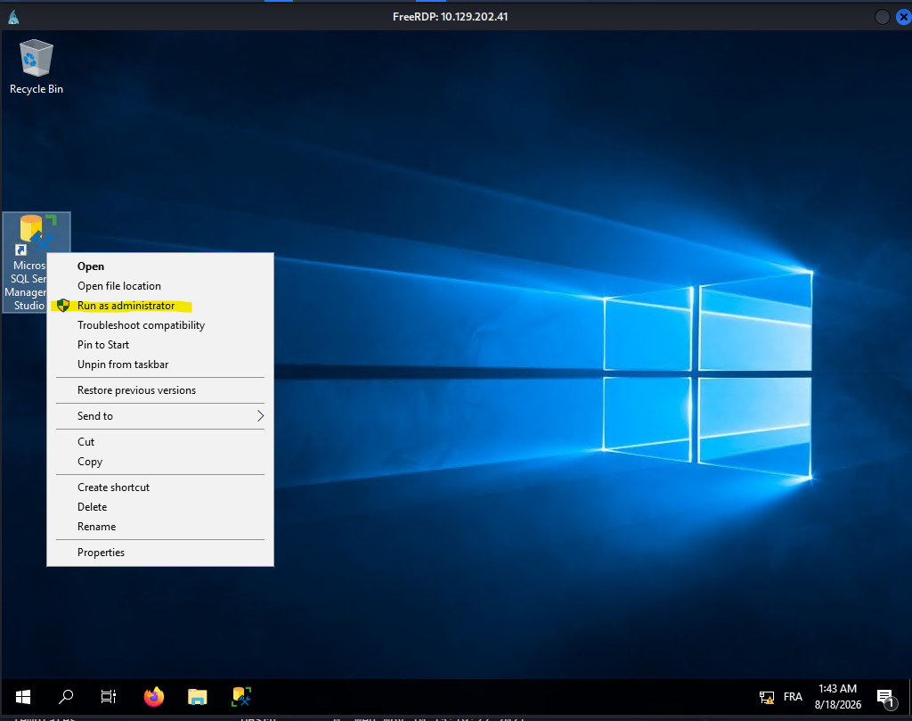
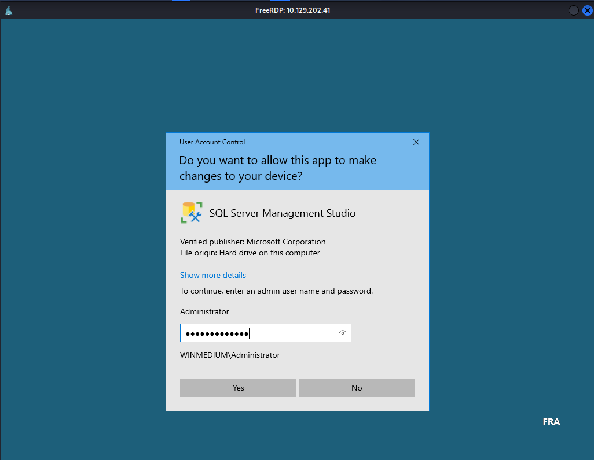
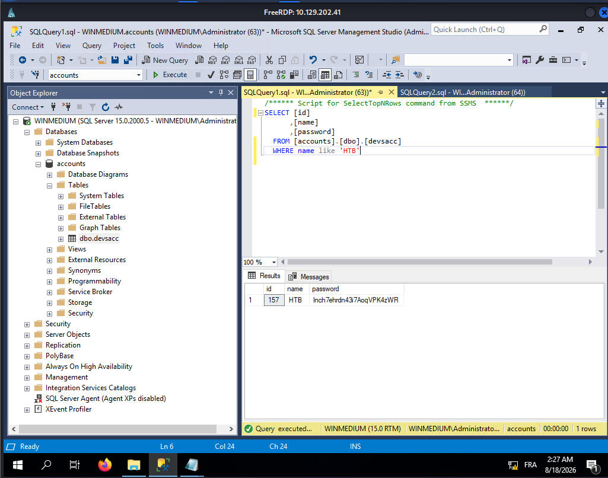

# Medium

## Nmap

```bash
┌──(kali㉿kali)-[~]
└─$ nmap -sV -sC -p- -T4 10.129.202.41  
Starting Nmap 7.99 ( https://nmap.org ) at 2026-08-18 10:06 +0200
Nmap scan report for 10.129.202.41
Host is up (0.092s latency).
Not shown: 65519 closed tcp ports (reset)
PORT      STATE SERVICE       VERSION
111/tcp   open  rpcbind       2-4 (RPC #100000)
| rpcinfo: 
|   program version    port/proto  service
|   100000  2,3,4        111/tcp   rpcbind
|   100000  2,3,4        111/tcp6  rpcbind
|   100000  2,3,4        111/udp   rpcbind
|   100000  2,3,4        111/udp6  rpcbind
|   100003  2,3         2049/udp   nfs
|   100003  2,3         2049/udp6  nfs
|   100003  2,3,4       2049/tcp   nfs
|   100003  2,3,4       2049/tcp6  nfs
|   100005  1,2,3       2049/tcp   mountd
|   100005  1,2,3       2049/tcp6  mountd
|   100005  1,2,3       2049/udp   mountd
|   100005  1,2,3       2049/udp6  mountd
|   100021  1,2,3,4     2049/tcp   nlockmgr
|   100021  1,2,3,4     2049/tcp6  nlockmgr
|   100021  1,2,3,4     2049/udp   nlockmgr
|   100021  1,2,3,4     2049/udp6  nlockmgr
|   100024  1           2049/tcp   status
|   100024  1           2049/tcp6  status
|   100024  1           2049/udp   status
|_  100024  1           2049/udp6  status
135/tcp   open  msrpc         Microsoft Windows RPC
139/tcp   open  netbios-ssn   Microsoft Windows netbios-ssn
445/tcp   open  microsoft-ds?
2049/tcp  open  nlockmgr      1-4 (RPC #100021)
3389/tcp  open  ms-wbt-server Microsoft Terminal Services
| ssl-cert: Subject: commonName=WINMEDIUM
| Not valid before: 2026-08-17T07:05:07
|_Not valid after:  2027-02-16T07:05:07
|_ssl-date: 2026-08-18T08:09:09+00:00; +2s from scanner time.
| rdp-ntlm-info: 
|   Target_Name: WINMEDIUM
|   NetBIOS_Domain_Name: WINMEDIUM
|   NetBIOS_Computer_Name: WINMEDIUM
|   DNS_Domain_Name: WINMEDIUM
|   DNS_Computer_Name: WINMEDIUM
|   Product_Version: 10.0.17763
|_  System_Time: 2026-08-18T08:09:01+00:00
5985/tcp  open  http          Microsoft HTTPAPI httpd 2.0 (SSDP/UPnP)
|_http-server-header: Microsoft-HTTPAPI/2.0
|_http-title: Not Found
47001/tcp open  http          Microsoft HTTPAPI httpd 2.0 (SSDP/UPnP)
|_http-title: Not Found
|_http-server-header: Microsoft-HTTPAPI/2.0
49664/tcp open  msrpc         Microsoft Windows RPC
49665/tcp open  msrpc         Microsoft Windows RPC
49666/tcp open  msrpc         Microsoft Windows RPC
49667/tcp open  msrpc         Microsoft Windows RPC
49678/tcp open  msrpc         Microsoft Windows RPC
49679/tcp open  msrpc         Microsoft Windows RPC
49680/tcp open  msrpc         Microsoft Windows RPC
49681/tcp open  msrpc         Microsoft Windows RPC
Service Info: OS: Windows; CPE: cpe:/o:microsoft:windows

Host script results:
| smb2-time: 
|   date: 2026-08-18T08:09:02
|_  start_date: N/A
|_clock-skew: mean: 1s, deviation: 0s, median: 1s
| smb2-security-mode: 
|   3.1.1: 
|_    Message signing enabled but not required
```

## NFS

```bash
┌──(kali㉿kali)-[~]
└─$ showmount -e 10.129.202.41       
Export list for 10.129.202.41:
/TechSupport (everyone)

┌──(kali㉿kali)-[~]
└─$ sudo mount -t nfs 10.129.202.41:/TechSupport /mnt/footprinting_medium

┌──(kali㉿kali)-[~]
└─$ ls -alh /mnt/footprinting_medium                       
ls: cannot open directory '/mnt/footprinting_medium': Permission denied

┌──(kali㉿kali)-[~]
└─$ ls -alh /mnt/                   
total 76K
drwxr-xr-x  4 root   root    4.0K Aug 18 10:11 .
drwxr-xr-x 18 root   root    4.0K Jun 29 17:32 ..
drwxrwxr-x  2 root   root    4.0K Feb 24 23:09 cdrom
drwx------  2 nobody nogroup  64K Nov 11  2021 footprinting_medium

┌──(kali㉿kali)-[~]
└─$ sudo ls -alh /mnt/footprinting_medium 
total 72K
drwx------ 2 nobody nogroup  64K Nov 11  2021 .
drwxr-xr-x 4 root   root    4.0K Aug 18 10:11 ..
-rwx------ 1 nobody nogroup    0 Nov 10  2021 ticket4238791283649.txt
-rwx------ 1 nobody nogroup    0 Nov 10  2021 ticket4238791283650.txt
[...SNIP...]
```

Recherche d'un fichier non vide
```bash
┌──(root㉿kali)-[~]
└─# find /mnt/footprinting_medium -maxdepth 1 -type f -size +0 -exec ls -lh {} + 
-rwx------ 1 nobody nogroup 1.3K Nov 10  2021 /mnt/footprinting_medium/ticket4238791283782.txt

┌──(root㉿kali)-[~]
└─# cat /mnt/footprinting_medium/ticket4238791283782.txt
Conversation with InlaneFreight Ltd

[...SNIP...]
 1smtp {
 2    host=smtp.web.dev.inlanefreight.htb
 3    #port=25
 4    ssl=true
 5    user="alex"
 6    password="lol123!mD"
 7    from="alex.g@web.dev.inlanefreight.htb"
 8}
 9
[...SNIP...]
```

credentials trouvés mais le port 25 est fermé
```
user="alex"
password="lol123!mD"
```

## SMB
```bash
┌──(kali㉿kali)-[~]
└─$ smbclient -N -L //10.129.202.41
session setup failed: NT_STATUS_ACCESS_DENIED


┌──(kali㉿kali)-[~]
└─$ smbclient -L //10.129.202.41 -U alex 
Password for [WORKGROUP\alex]:

	Sharename       Type      Comment
	---------       ----      -------
	ADMIN$          Disk      Remote Admin
	C$              Disk      Default share
	devshare        Disk      
	IPC$            IPC       Remote IPC
	Users           Disk      
Reconnecting with SMB1 for workgroup listing.
do_connect: Connection to 10.129.202.41 failed (Error NT_STATUS_RESOURCE_NAME_NOT_FOUND)
Unable to connect with SMB1 -- no workgroup available
```


```bash
┌──(kali㉿kali)-[~]
└─$ smbclient //10.129.202.41/devshare -U alex
Password for [WORKGROUP\alex]:
Try "help" to get a list of possible commands.
smb: \> ls
  .                                   D        0  Wed Nov 10 17:12:22 2021
  ..                                  D        0  Wed Nov 10 17:12:22 2021
  important.txt                       A       16  Wed Nov 10 17:12:55 2021

		6367231 blocks of size 4096. 2588133 blocks available
smb: \> 


smb: \> get important.txt
getting file \important.txt of size 16 as important.txt (0.0 KiloBytes/sec) (average 0.0 KiloBytes/sec)
smb: \> !cat important.txt
sa:87N1ns@slls83smb: \> 
```

```
sa:87N1ns@slls83
```

## RDP

```bash
┌──(kali㉿kali)-[~]
└─$ xfreerdp /u:alex /p:'lol123!mD' /v:10.129.202.41
```





Par chance le mot de passe `sa` passe en `administrator`







j'ai fait un select Top 1000 Rows et j'ai modifié ensuite la query de 
```sql
SELECT TOP (1000) [id]
      ,[name]
      ,[password]
  FROM [accounts].[dbo].[devsacc]
```
en
```sql
SELECT [id]
      ,[name]
      ,[password]
  FROM [accounts].[dbo].[devsacc]
  WHERE name like 'HTB'
```


```
HTB
lnch7ehrdn43i7AoqSNIP
```
