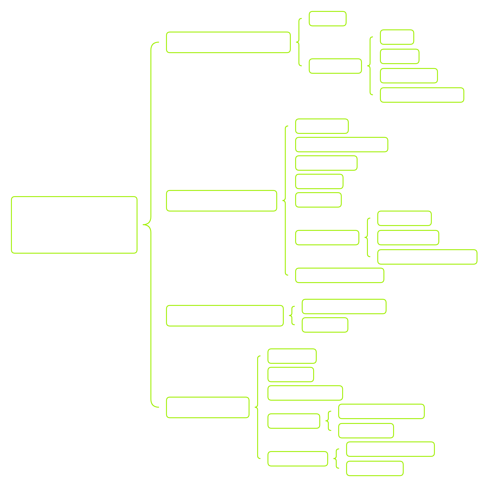

# Gathering System Information



## Systeminfo 

```shell
C:\htb> systeminfo


Host Name:                 DESKTOP-htb
OS Name:                   Microsoft Windows 10 Pro
OS Version:                10.0.19042 N/A Build 19042
OS Manufacturer:           Microsoft Corporation
OS Configuration:          Standalone Workstation
OS Build Type:             Multiprocessor Free

<snipped>
```

## Network

```shell
C:\htb> ipconfig
<SNIP>
```

## ARP

```shell
C:\htb> arp /a

<SNIP>

Interface: 10.0.25.17 --- 0x17
  Internet Address      Physical Address      Type
  10.0.25.1             00-e0-67-15-cf-43     dynamic
  10.0.25.5             54-9f-35-1c-3a-e2     dynamic
  10.0.25.10            00-0c-29-62-09-81     dynamic
  10.0.25.255           ff-ff-ff-ff-ff-ff     static
<SNIP>

```

## USer

```shell
C:\htb> whoami

ACADEMY-WIN11\htb-student
```

```shell
C:\htb> whoami /priv

PRIVILEGES INFORMATION
----------------------

Privilege Name                Description                          State
============================= ==================================== ========
SeShutdownPrivilege           Shut down the system                 Disabled
SeChangeNotifyPrivilege       Bypass traverse checking             Enabled
SeUndockPrivilege             Remove computer from docking station Disabled
SeIncreaseWorkingSetPrivilege Increase a process working set       Disabled
SeTimeZonePrivilege           Change the time zone                 Disabled
```

```shell
C:\htb> whoami /groups

GROUP INFORMATION
-----------------

Group Name                             Type             SID          Attributes
====================================== ================ ============ ==================================================
Everyone                               Well-known group S-1-1-0      Mandatory group, Enabled by default, Enabled group
BUILTIN\Users                          Alias            S-1-5-32-545 Mandatory group, Enabled by default, Enabled group
BUILTIN\Performance Log Users          Alias            S-1-5-32-559 Mandatory group, Enabled by default, Enabled group
NT AUTHORITY\INTERACTIVE               Well-known group S-1-5-4      Mandatory group, Enabled by default, Enabled group
CONSOLE LOGON                          Well-known group S-1-2-1      Mandatory group, Enabled by default, Enabled group
NT AUTHORITY\Authenticated Users       Well-known group S-1-5-11     Mandatory group, Enabled by default, Enabled group
NT AUTHORITY\This Organization         Well-known group S-1-5-15     Mandatory group, Enabled by default, Enabled group
NT AUTHORITY\Local account             Well-known group S-1-5-113    Mandatory group, Enabled by default, Enabled group
LOCAL                                  Well-known group S-1-2-0      Mandatory group, Enabled by default, Enabled group
NT AUTHORITY\NTLM Authentication       Well-known group S-1-5-64-10  Mandatory group, Enabled by default, Enabled group
Mandatory Label\Medium Mandatory Level Label            S-1-16-8192
```

```shell
C:\htb> whoami /all
```

## Net User

```shell
C:\htb> net user

User accounts for \\ACADEMY-WIN11

-------------------------------------------------------------------------------
Administrator            DefaultAccount           Guest
htb-student              WDAGUtilityAccount
The command completed successfully.
```

## Net Group / Localgroup

```shell
C:\htb> net group
net group
This command can be used only on a Windows Domain Controller.

More help is available by typing NET HELPMSG 3515.
```

```shell
C:\htb> net localgroup

Aliases for \\ACADEMY-WIN11

-------------------------------------------------------------------------------
*__vmware__
*Access Control Assistance Operators
*Administrators
*Backup Operators
*Cryptographic Operators
*Device Owners
*Distributed COM Users
*Event Log Readers
*Guests
*Hyper-V Administrators
*IIS_IUSRS
*Network Configuration Operators
*Performance Log Users
*Performance Monitor Users
*Power Users
*Remote Desktop Users
*Remote Management Users
*Replicator
*System Managed Accounts Group
*Users
The command completed successfully.
```


## Net Share

```shell
C:\htb> net share  

Share name   Resource                        Remark

-------------------------------------------------------------------------------
C$           C:\                             Default share
IPC$                                         Remote IPC
ADMIN$       C:\Windows                      Remote Admin
Records      D:\Important-Files              Mounted share for records storage  
The command completed successfully.
```

```shell
C:\htb> net view
```
